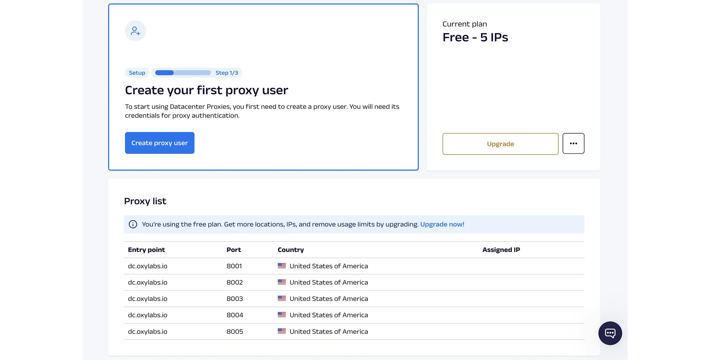
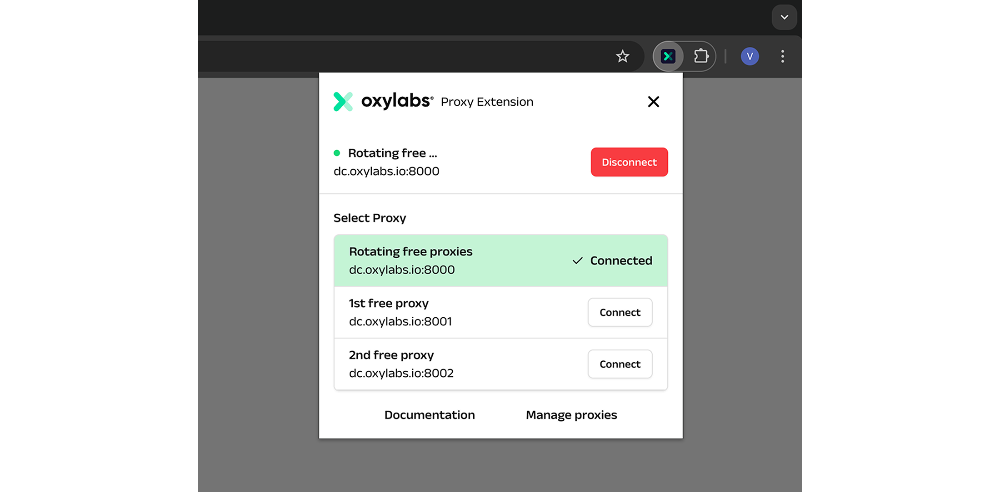

# Free Proxy Servers

Get lifetime access to free US proxy servers. Simply sign up on the [dashboard](https://dashboard.oxylabs.io/) to unlock premium features including:

- [x] Free HTTP/HTTPS/SOCKS5 proxies
- [X] 20 concurrent sessions
- [X] 5GB of traffic per month across 5 US IPs
- [X] Exceptional performance & speed


## Free US proxy server list

Sign up for a free account and create a proxy user to instantly access your proxy list. For enhanced functionality and flexibility, upgrade to a paid plan starting at just $1.20 per IP.

| Entry Point   | Port  | Country       | Assigned IPs   |
|--------------|-------|---------------|----------------|
| dc.oxylabs.io | 8001 | United States | ░░░░░.░░░.░░.░░░ |
| dc.oxylabs.io | 8002 | United States | ░░░░░.░░░.░░.░░░ |
| dc.oxylabs.io | 8003 | United States | ░░░░░.░░░.░░.░░░ |
| dc.oxylabs.io | 8004 | United States | ░░░░░.░░░.░░.░░░ |
| dc.oxylabs.io | 8005 | United States | ░░░░░.░░░.░░.░░░ |


## How to get free proxy IPs

1. Start by creating your account on the [Oxylabs dashboard](https://dashboard.oxylabs.io/).
2. Head to the [Datacenter Proxies page](https://dashboard.oxylabs.io/en/overview/datacenter-proxies) and create a proxy user.
3. Test the connection using a proxy manager or send a web request via cURL, Python, or your preferred setup.




## Easy proxy management on Chrome

[Oxy® Proxy Manager](https://oxylabs.io/products/chrome-proxy-extension) is a **free Chrome extension**, enabling you to easily switch between multiple IP addresses during browsing sessions. See the [integration steps](https://developers.oxylabs.io/proxies/integration-guides/shared-datacenter-proxies-guides/oxy-proxy-extension-for-chrome) to find out more.



## Simple integration

Oxylabs' free premium proxies easily integrate with various third-party tools and enhance their functionality. Explore detailed [integration guides](https://oxylabs.io/resources/integrations) and  [documentation](https://developers.oxylabs.io/proxies/datacenter-proxies/free-datacenter-ips).

[](https://curl.se) [](https://python.org) [](https://developer.mozilla.org/en-US/docs/Web/JavaScript) [](https://php.net) [](https://go.dev) [](https://www.java.com) [](https://dotnet.microsoft.com/languages/csharp)

### Python integration example

```python
# Use `pip install requests` beforehand.
import requests

# Replace with your proxy user credentials.
username = 'USERNAME'
password = 'PASSWORD'

# Port `8000` rotates IPs from your proxy list.
address = 'dc.oxylabs.io:8000'

proxies = {
   'https': f'https://user-{username}:{password}@{address}'
}

response = requests.get('https://ip.oxylabs.io/location', proxies=proxies)

print(response.text)
```


